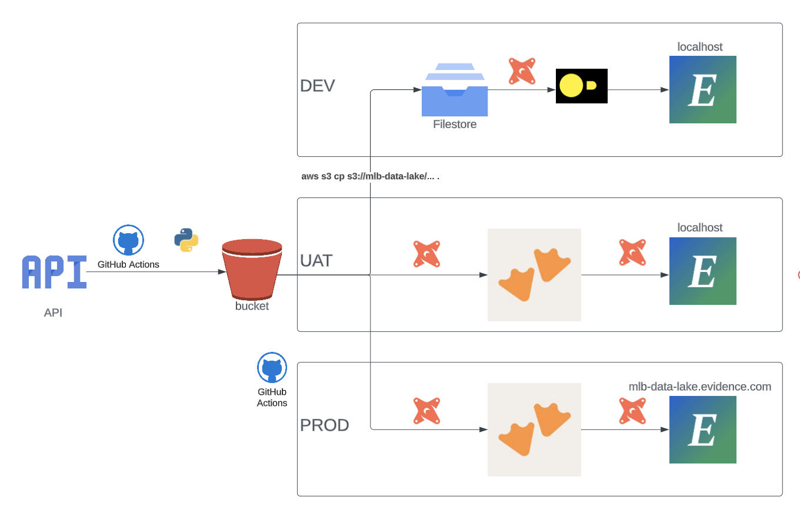
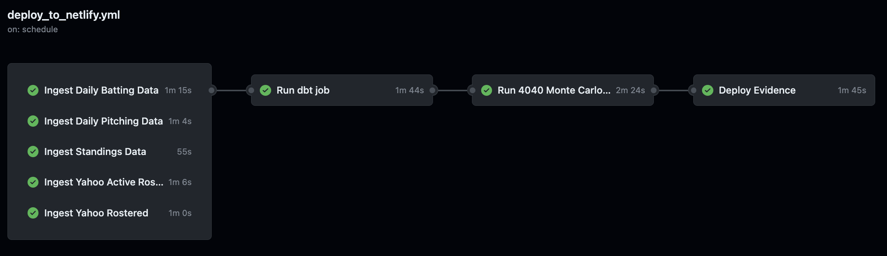

# mlb-data-lake

You can see the final product here: [mlb-data-lake.netlify.app](https://mlb-data-lake.netlify.app)

## Description

The purpose of this project is to give myself an end to end analytics app so I can explore and learn about different tools in the ecosystem. 

The different layers I have are:

* orchestration (ex. dagster)
* ingestion (ex. read data from API and write to s3)
* extract and load (ex. meltano to read data from s3 into duckdb)
* storage (ex. postgres)
* transform (ex. dbt to currate data mart)
* advanced analytics (ex. churn prediction)
* visualization (ex. Tableau dashboard)

## High Level Architecture

[Lucid Chart](https://lucid.app/lucidchart/64b88329-46d6-4283-b875-fea82e9b328a/edit?view_items=DHbh.MwD~tuD&invitationId=inv_aec05db6-afbd-4dc8-831b-353bb2e5a6ce)

***

### Orchestration

#### Current Implentation

* 

#### Possible Implementations

* dagster

*** 

### Ingestion

#### Current Implentation

* using different python libraries to read in dataframes and write them to s3 using awswrangler
    * libraries - awswrangler, boto3, pybaseball, yahoo_fantasy_api, yahoo_oauth

#### Possible Implementations

* could write straight to duckdb/motherduck instead of s3
* sources (python libraries, webscrapiing, apis)
* languages (go, rust)
* tools (meltano, fivetran, airbyte)

*** 

### Extract and Load

#### Current Implentation

* None. Using external tables

#### Possible Implementations

* meltano
* fivetran
* airbyte

*** 

### Storage

#### Current Implentation

* using duckdb locally and motherduck in a uat and production enviroment

#### Possible Implementations

* postgres

*** 

### Transform

#### Current Implentation

* dbt-duckdb

#### Possible Implementations

* sqlmesh

*** 

### Advanced Analytics

#### Current Implentation

* python script creating a Monte Carlo Simulation 

#### Possible Implementations

* need to do more research generally here

*** 

### Visualization

#### Current Implentation

* evidence.dev

#### Possible Implementations

* rill - https://www.rilldata.com/
* Streamlit - https://streamlit.io/

